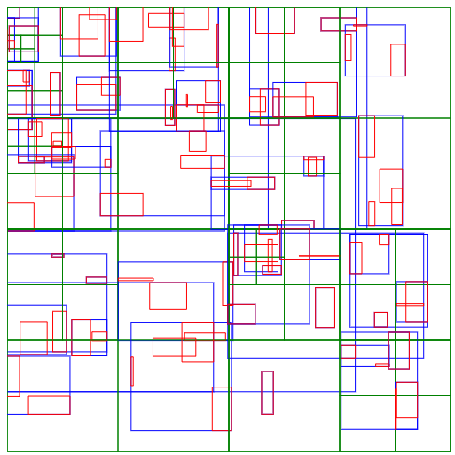

# Geom2.js


**Geom2.js** is a high-performance javascript **2d geometry** library written in modern **TypeScript**.

It was extracted from the server-side code of a multi-player game.
It is intended to be used in games, ai or any computation heavy task in javascript.

In a game application, it can be used for collision detection, artificial intelligence
(steering and path finding), server-client viewport optimization.

### Difference from Physics Engines

Most physics engines bundles all the physics related data structure and 
algorithm together. It makes setup easy but it limits the flexibility of
the application or games. Because in lots of scenario except physics simulation,
objects are not intended to move according to physics laws.

This library is much light weight than a physics engine, and gives users a customizable
environment to setup their own 2d world.

### Install
#### npm install
```bash
npm install geom2.js
```

#### browser install
Copy example/geom2.min.js or build yourself

### Examples
Check [test](test) folder

We provide a **QuadTree** example [here](example/lqtree.html).



More examples will come up later.

## Structure:
* Vector
* Segment
* Shap
    * AABB (Axis-Aligned Bounding Box)
    * Arc
    * Circle
    * Polygon

## Algorithm:
* Common
    * Collision detection between shapes.
        * GJK (Gilbert–Johnson–Keerthi)
        * SAT (Separation Axis Theorem)
    * Convex Polygon test
    * Convex Hull
* Generation
    * Random convex polygon generation
* Advance
    * Field of view scanning (line sweeping)

## Container:
* Loose QuadTree
    * High-quality quadtree implementation
    * It can store AABB (Axis-Aligned Bounding Box).
    * No elements on branch nodes, all data on leaves.
    * It maintains loose boundary on all nodes.
    * It outperforms simple-quadtree and all other available js quadtree.

## Addition Feature:
* Physics Collision Resolution


## TODO
- Special handling circle-polygon and circle-circle collision